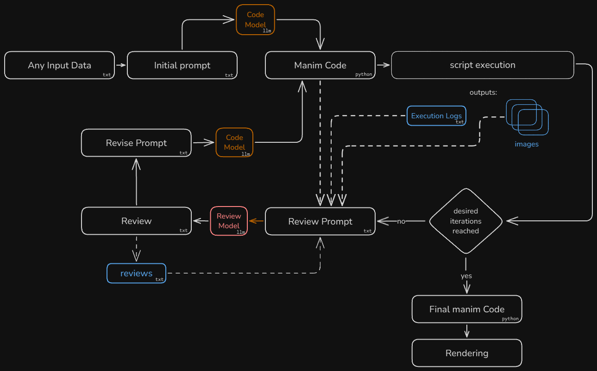

# AI - Manim Video Generator

Automatic video generation using an agentic LLM flow in combination with the [manim](https://www.manim.community/) python library.

## Overview

The project experiments with automated Manim video creation. An agent workflow delegates code drafting to a `Code Writer` and validation to a `Code Reviewer`, using LiteLLM for model routing so different models from different providers can be compared on the same task. The flow focuses on reducing render failures and improving visual consistency through iterative feedback and optional vision inputs.

## Manim Bench - Leaderboard 📊 

[](https://manim-bench.makefinks.dev)

The manim-generator harness now drives **Manim Bench**, a public leaderboard showcasing how latest AI models compare on full Manim video generation.

> [manim-bench.makefinks.dev](https://manim-bench.makefinks.dev) 

If you want to see examples of videos created with this project, or are interested in how different models stack up, visit the link above. Feedback appreciated!


## Current Video Generation Process



## Installation

### 1. Clone the repository:

```bash
git clone https://github.com/makefinks/manim-generator.git
cd manim-generator
```

### 2. Install the requirements

With [uv](https://github.com/astral-sh/uv) (recommended):

```bash
uv sync
```

Or using pip directly:

```bash
python -m venv .venv
source .venv/bin/activate # or .venv/scripts/activate on windows
pip install -e .
```

### 3. Additional dependencies

Install ffmpeg and, if you plan to render LaTeX, a LaTeX distribution.

Windows (using Chocolatey):

```bash
choco install ffmpeg
choco install miktex
```

macOS (using Homebrew):

```bash
brew install ffmpeg
brew install --cask mactex
```

Linux (Debian/Ubuntu):

```bash
sudo apt-get update
sudo apt-get install texlive texlive-latex-extra texlive-fonts-extra texlive-science
```

### 4. Configure environment variables

Create a `.env` file from the provided template:

```bash
cp .env.example .env
```

Then edit `.env` and add your API keys. Providers available via [openrouter](https://openrouter.ai/) are supported through LiteLLM with the prefix openrouter.
For example `openrouter/openai/gpt-5.1`

If you configure or have an openai/anthropic API key already configured you can use their respective APIs directly: `openai/gpt-5.1` / `anthropic/claude-sonnet-4-5`

## Usage

### 1. Execute the script

With uv (recommended):

```bash
uv run manim-generate
```

Or if you've activated the virtual environment:

```bash
source .venv/bin/activate
manim-generate
```

Or using Python directly:

```bash
python -m manim_generator.main
```

### 2. CLI Arguments

The script supports the following command-line arguments:

#### Video Data Input

| Argument            | Description                                        | Default          |
| ------------------- | -------------------------------------------------- | ---------------- |
| `--video-data`      | Description of the video to generate (text string) | -                |
| `--video-data-file` | Path to file containing video description          | "video_data.txt" |

#### Model Configuration

| Argument         | Description                                                                              | Default                                |
| ---------------- | ---------------------------------------------------------------------------------------- | -------------------------------------- |
| `--manim-model`  | Model to use for generating Manim code                                                   | "openrouter/anthropic/claude-sonnet-4" |
| `--review-model` | Model to use for reviewing code                                                          | "openrouter/anthropic/claude-sonnet-4" |
| `--streaming`    | Enable streaming responses from the model                                                | False                                  |
| `--temperature`  | Temperature for the LLM Model                                                            | 0.4                                    |
| `--force-vision` | Adds images to the review process, regardless if LiteLLM reports vision is not supported | -                                      |
| `--provider`     | Specific provider to use for OpenRouter requests (e.g., 'anthropic', 'openai')           | -                                      |

#### Process Configuration

| Argument                  | Description                                                                                 | Default                                        |
| ------------------------- | ------------------------------------------------------------------------------------------- | ---------------------------------------------- |
| `--review-cycles`         | Number of review cycles to perform                                                          | 5                                              |
| `--manim-logs`            | Show Manim execution logs                                                                   | False                                          |
| `--output-dir`            | Directory for generated artifacts (overrides auto-naming)                                   | Auto (e.g., `manim_animation_20250101_120000`) |
| `--success-threshold`     | Percentage of scenes that must render successfully to trigger enhanced visual review mode   | 100                                            |
| `--frame-extraction-mode` | Frame extraction mode: highest_density (single best frame) or fixed_count (multiple frames) | "highest_density"                              |
| `--frame-count`           | Number of frames to extract when using fixed_count mode                                     | 3                                              |
| `--scene-timeout`         | Maximum seconds allowed for a single scene render (set to 0 to disable)                     | 120                                            |
| `--headless`              | Suppress most output and show only a single progress bar                                    | False                                          |

#### Reasoning Tokens Configuration

| Argument                 | Description                                                                                  | Default |
| ------------------------ | -------------------------------------------------------------------------------------------- | ------- |
| `--reasoning-effort`     | Reasoning effort level for OpenAI-style models (choices: "none", "minimal", "low", "medium", "high", "xhigh") | -       |
| `--reasoning-max-tokens` | Maximum tokens for reasoning (Anthropic-style)                                               | -       |
| `--hide-reasoning`       | Hide reasoning tokens from response output (model still uses reasoning internally). | -       |

> Note: You cannot use both `--reasoning-effort` and `--reasoning-max-tokens` at the same time.

Providing `--output-dir` skips the automatic descriptor-based folder name and uses the supplied path instead.

### Example

```bash
uv run manim-generate --video-data "Explain the concept of neural networks with visual examples" --manim-model "openrouter/anthropic/claude-sonnet-4" --review-model "openrouter/anthropic/claude-sonnet-4" --review-cycles 3
```

Or with the command directly (if virtual environment is activated):

```bash
manim-generate --video-data "Explain the concept of neural networks with visual examples" --manim-model "openrouter/anthropic/claude-sonnet-4" --review-model "openrouter/anthropic/claude-sonnet-4" --review-cycles 3
```

Some standard prompts for benchmarking different models are in the directoy `bench_prompts/`

```
manim-generate --video-data-file bench_prompts/llm_explainer.txt
```

### 3. Configure image support

Images are available only when the reviewer model supports multimodal input.

- https://openrouter.ai/models?modality=text+image-%3Etext
- https://github.com/BerriAI/litellm/blob/main/model_prices_and_context_window.json

## Contributing

Focus areas include prompt improvements, review loop refinements, code quality, and new features or optimizations.

### Known issues

- **Streaming**: current streaming implementation does not provide syntax highlighting
- **Prompting / environment setup**: the selected LLM version may not match the local installation.
